# MCP Tutorial

The following is our MCP tutorial. This tutorial will focus specifically on the "Github MCP Server", which can be integrated within Visual Studio Code, to allow AI assistants access to your Github depositories of choice. 

As a prerequisite, ensure you have a recent version of ***Visual Studio Code*** installed for optimal results.

## Step 1 - Settings
Firstly we should check our Visual Studio Code installation's settings, to ensure that access to MCP is enabled.

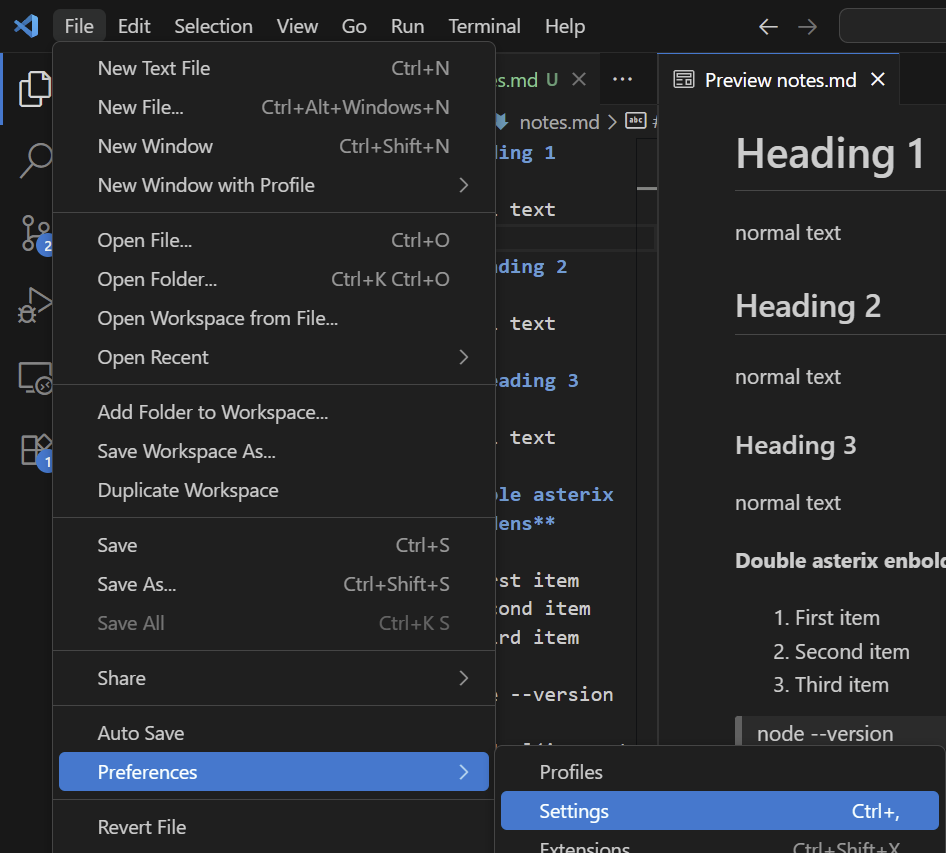

Within the settings, we want to make sure we're in the Chat tab and ensure that the Agent option is ticked as shown.

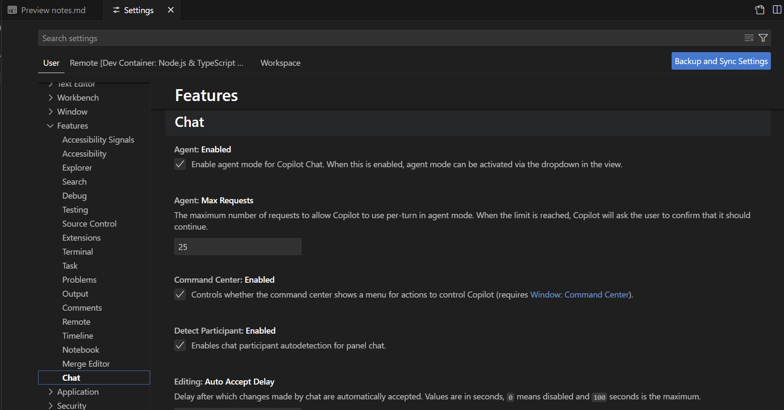

We can also search "chat.mcp" within the settings search bar to check if additional settings are enabled.

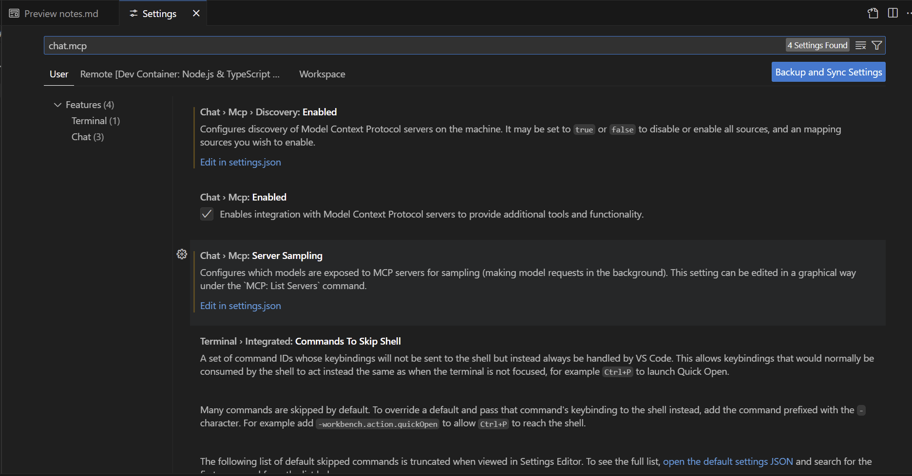

If the following settings are enabled, we can proceed to the installation.

## Step 2 - Installation

The following link is the [Github page for the Github MCP Server](https://github.com/github/github-mcp-server?tab=readme-ov-file) 

Here we can see the Github page

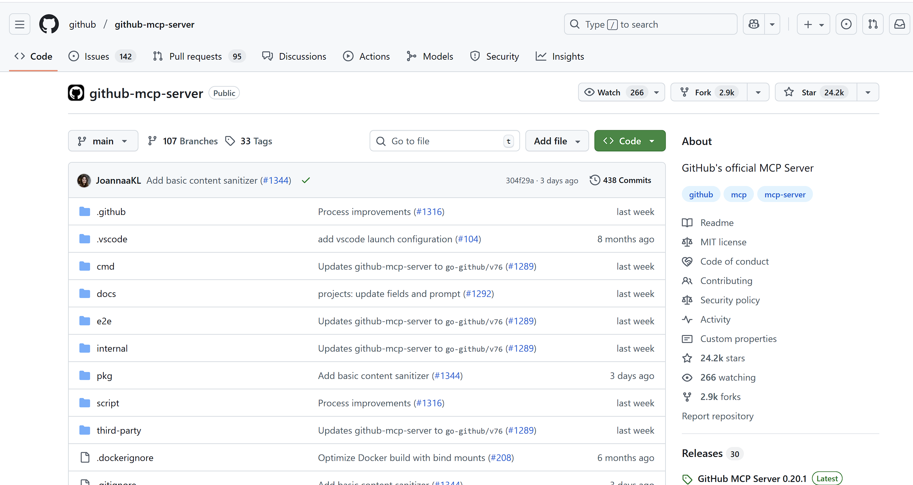

Upon scrolling down this page, we will see an option to install the Remote Github MCP Server.

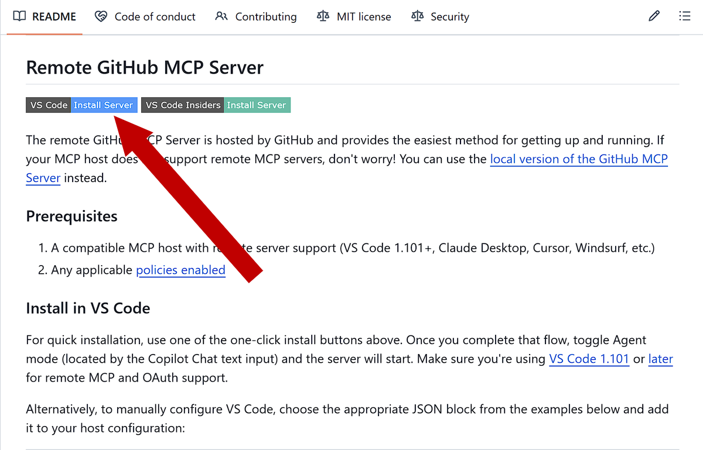

You will be prompted if you wish to install Visual Studio Code. Proceed by clicking Open.

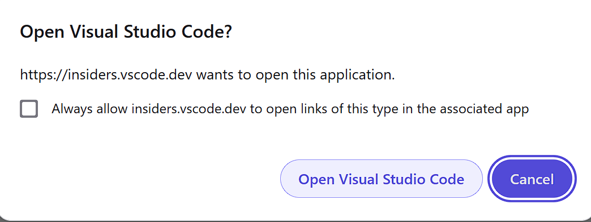

This will open up a new tab in your last used Visual Studio Code instance, click install and you can proceed to setting up Copilot for use in chat.
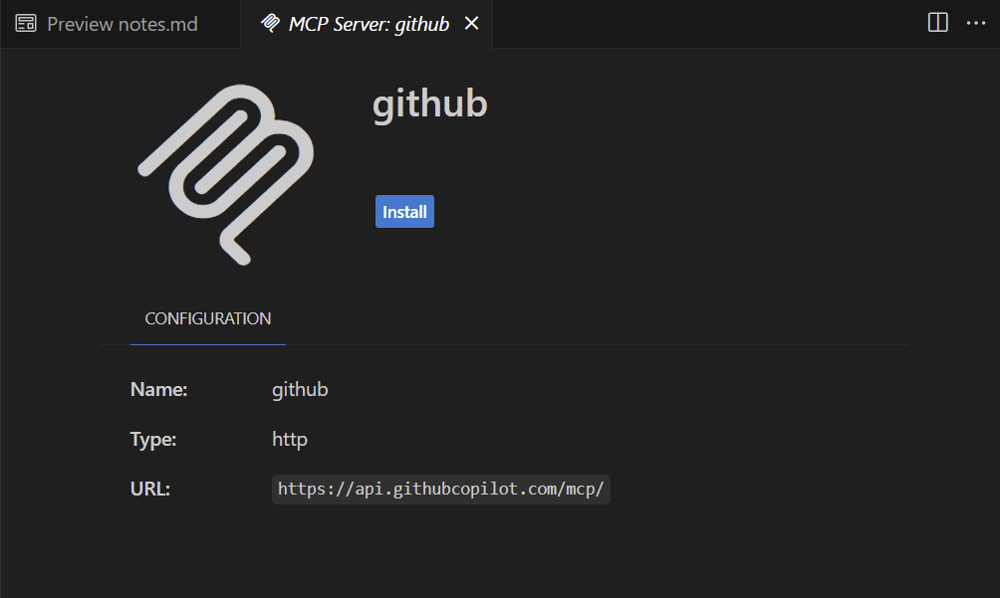

## Copilot

Click on view and locate Chat and click on it.
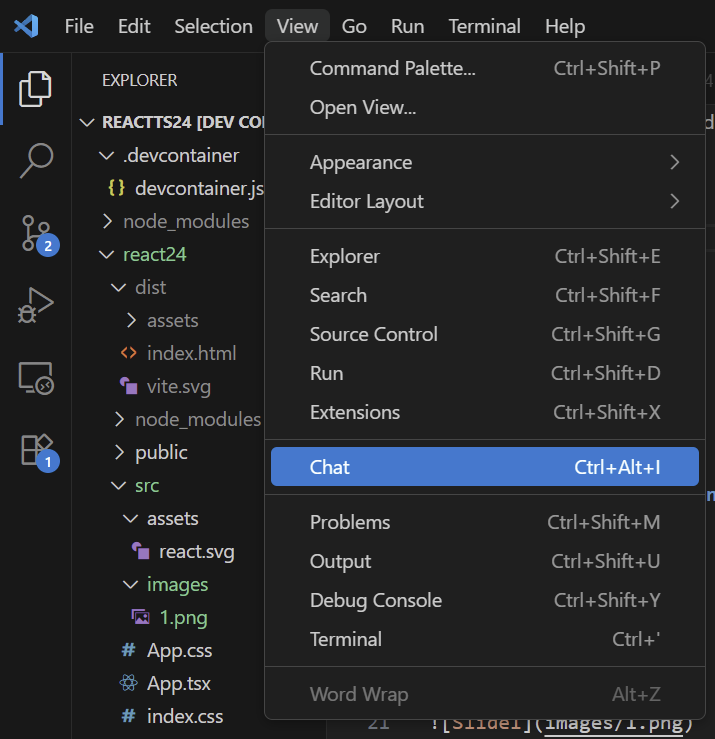

A new tab should show up with Chatbot functionality.
However, if you try to type a message you will be asked to set up Copilot
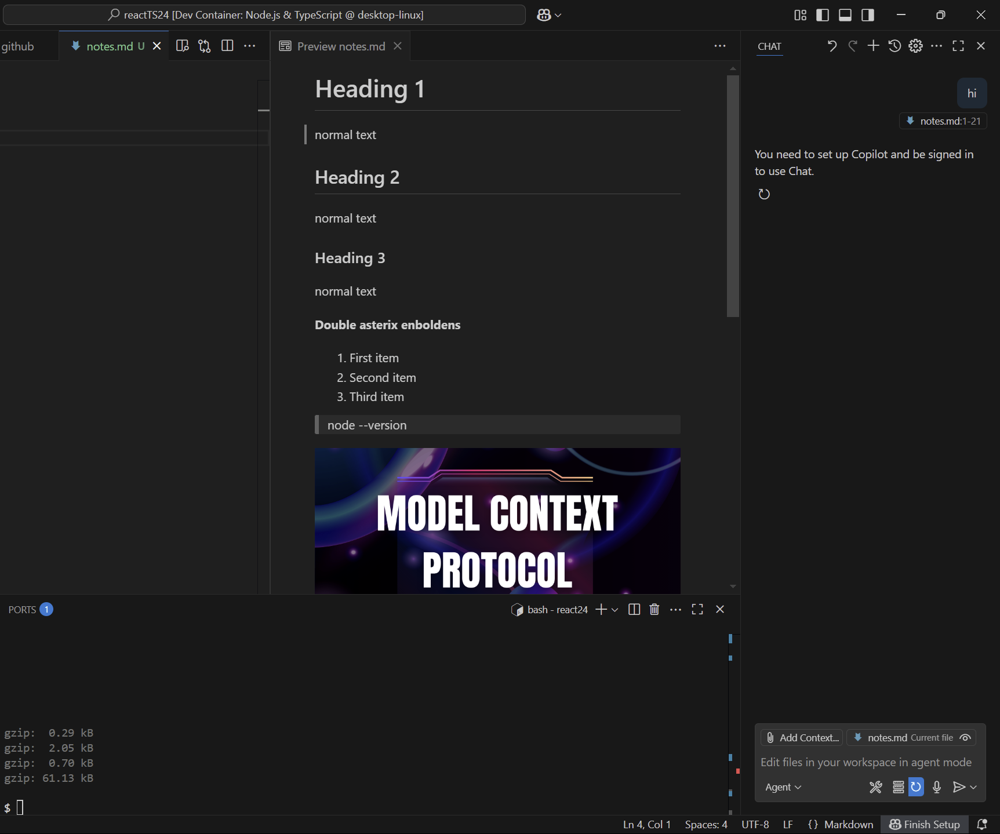

Click set up Copilot
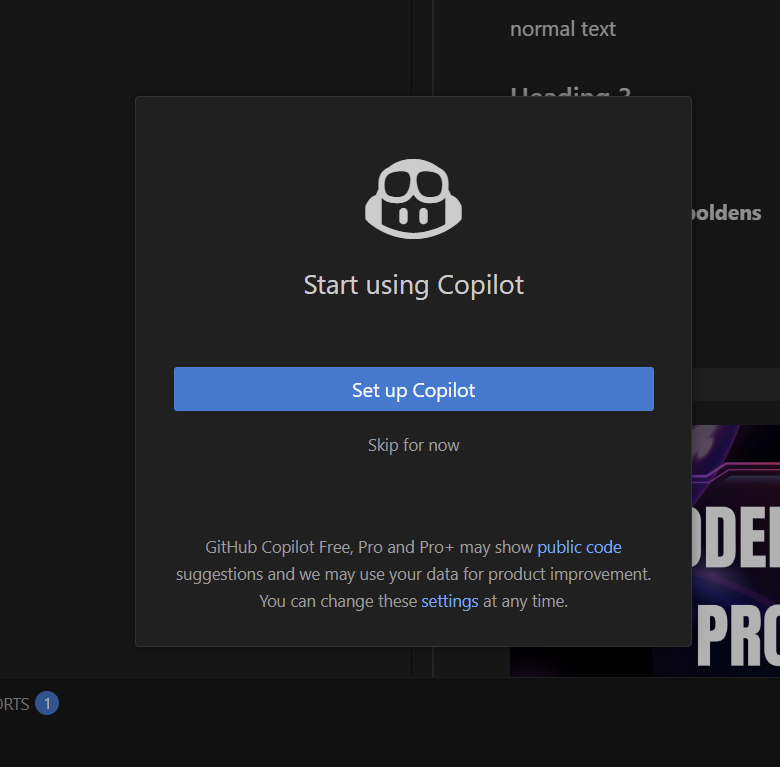

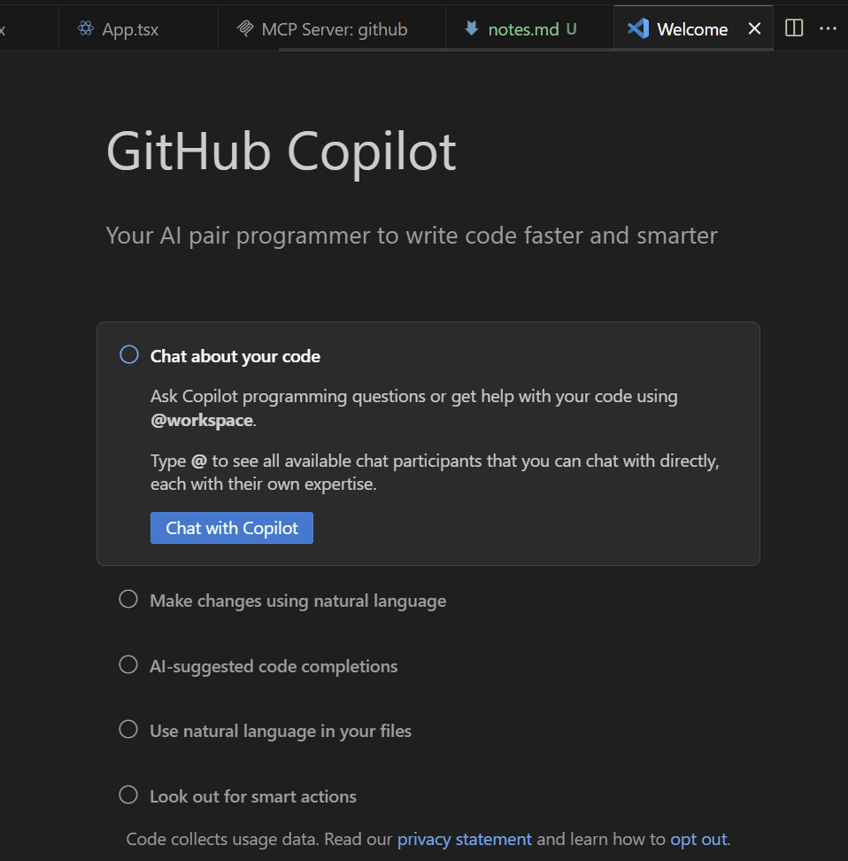

You can select Claude Sonnet 3.5 when clicking on Auto.
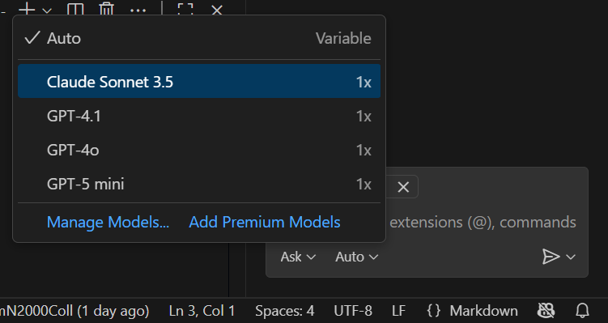

Click enable and you can use Anthropic's own AI assistant to help you.
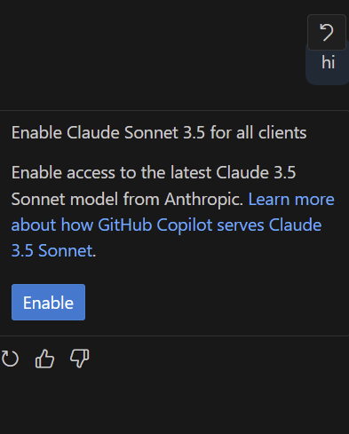

Click on extensions in the sidebar and locate "MCP Servers Installed" in the bottom. Github should show as installed.
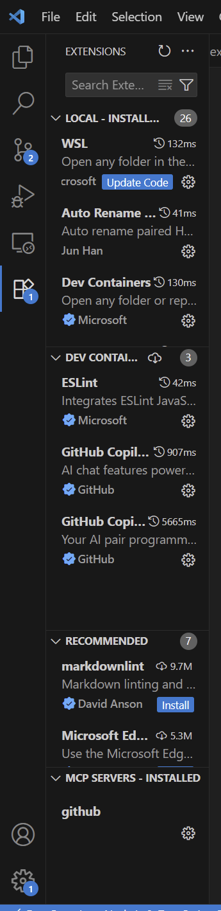

---
---
---
---
---
---
---
---

### UNDER CONSTRUCTION?

Click on the Cog which will say "Manage" when hovered over.
Then click "Start Server".

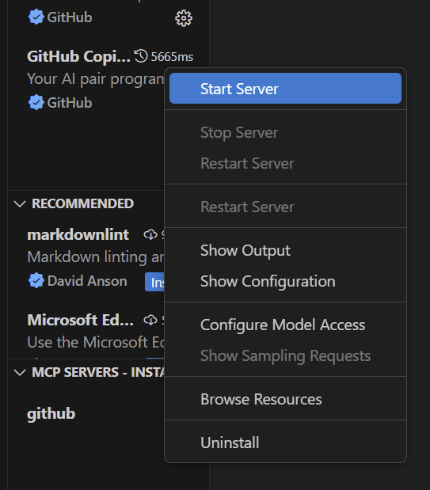

You will be asked to authenticate via Github, click "allow".
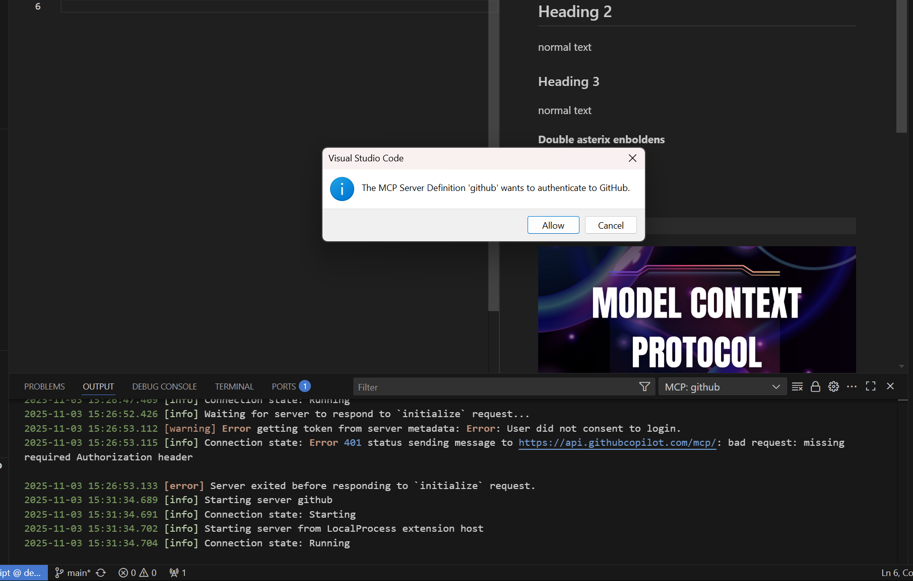

If you are stuck in a loading loop, you can click cancel on the notification at the bottom left of your VSC instance and it will give you the option try the url handler to authorize.

Click yes
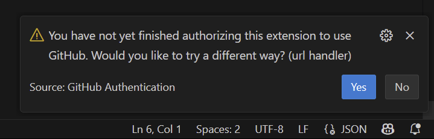

You can now select your account to Authorize Visual Studio Code
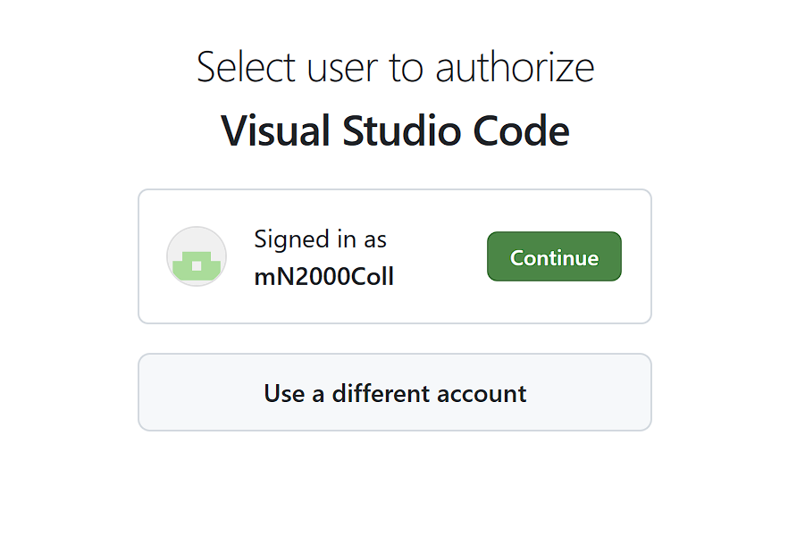

You will be asked for further permissions, click on Authorize

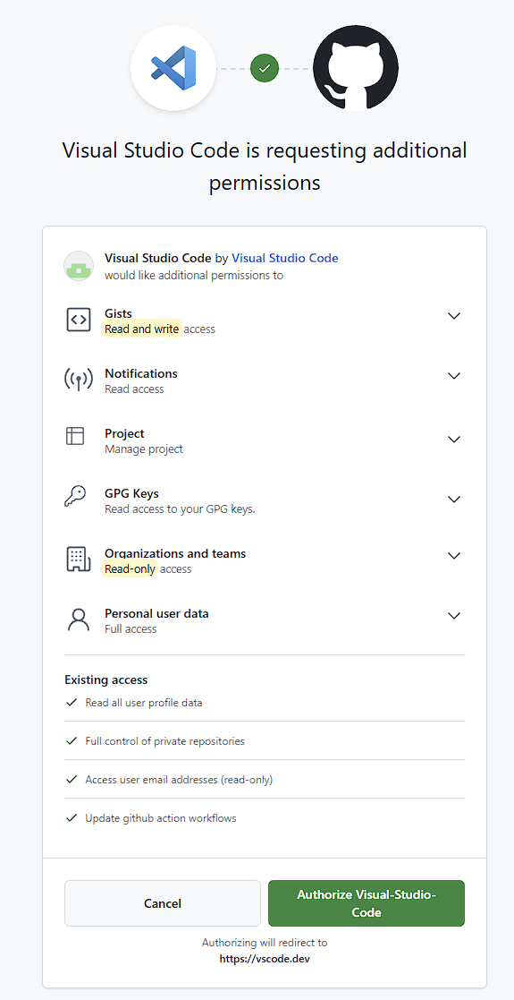

